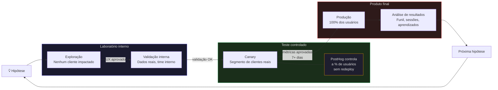
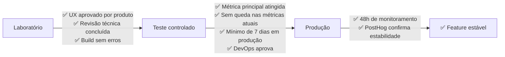

# Como o Adsmagic lança features sem arriscar o produto

:::info Para a diretoria
Esta página explica como o time entrega melhorias contínuas no produto sem expor usuários reais a código não validado. Sem custo extra de infraestrutura. Sem necessidade de janela de manutenção.
:::

---

## O que você precisa saber

Toda nova funcionalidade no Adsmagic passa por três ambientes antes de chegar a todos os usuários:

1. **Laboratório interno** — o time testa sem afetar nenhum cliente.
2. **Teste controlado** — um grupo pequeno de usuários reais usa a novidade. Os demais continuam na experiência atual.
3. **Produção** — após aprovação por métricas, a feature vai para todo o tráfego.

Cada etapa tem critério claro de avanço. Nada sobe sem aprovação. E se algo der errado no teste controlado, o rollback leva segundos — sem redeploy, sem suporte técnico, sem impacto ao restante da base.

---

## Por que isso importa para o negócio

Antes desse modelo, qualquer mudança ia direto para 100% dos usuários. Uma hipótese ruim sobre o hero da landing page, um fluxo de onboarding repensado ou um componente de relatório redefinido chegava a todos ao mesmo tempo — sem validação, sem possibilidade de comparar versões, sem dado para decidir se foi melhor ou pior.

O custo desse modelo antigo é invisível até aparecer: queda de conversão, sessões interrompidas, suporte acionado.

**Com o modelo atual:**

- Hipóteses ruins são descartadas antes de impactar receita.
- Hipóteses boas chegam a todos com dado que justifica a decisão.
- O time entrega mais rápido porque o risco de cada entrega é menor.

---

## Os três ambientes

| | Laboratório (Workspace) | Teste controlado (Canary) | Produto final (Produção) |
|---|---|---|---|
| **Para que serve** | Criar e validar hipóteses internamente | Testar com uma fração de usuários reais | Entregar para toda a base |
| **Quem usa** | Time de produto e engenharia | Segmento selecionado de clientes | Todos os usuários |
| **Dados reais?** | Não — simulação local | Sim | Sim |
| **Impacto se algo falha** | Zero — ambiente isolado | Mínimo — só o segmento de teste | Gerenciado — rollback documentado |
| **Custo de infraestrutura** | R$ 0 | R$ 0 | R$ 0 |

O teste controlado usa o **PostHog** — ferramenta já instalada e paga — para controlar qual porcentagem da base vê a novidade. A diretoria pode ver os resultados em tempo real no painel. Sem redeploy, sem intervenção técnica para ajustar a amostra.

---

## O caminho de uma ideia até o usuário

Toda hipótese nasce internamente e só chega ao produto quando passou pelos três filtros: validação de UX, validação com dados reais, e validação com usuários reais.

---

## Como o teste controlado funciona na prática

Quando uma hipótese entra na fase de teste controlado, o time de produto define no PostHog qual porcentagem de usuários vai ver a versão nova.

O restante da base continua na experiência atual, sem perceber que há um teste em andamento. As métricas das duas experiências são capturadas em tempo real — conversão, progressão de funil, qualidade das sessões.

Se o resultado for negativo, o time desativa o teste em segundos. Se for positivo, a feature vai para todos com dado que justifica a decisão.

---

## Proteção de dados durante o desenvolvimento

O laboratório interno nunca usa dados reais de clientes. Os tokens de produção — conexões com Meta Ads, Supabase e outros serviços — só chegam ao ambiente de teste controlado, e só depois de revisão técnica.

Isso garante que nenhum dado de cliente fique exposto a código que ainda não passou por aprovação.

---

## Custo total deste modelo

| Item | Custo |
|---|---|
| Infraestrutura adicional | R$ 0 — Cloudflare Pages é gratuito no volume atual |
| Ferramenta de testes A/B | R$ 0 extra — PostHog já está instalado e pago |
| Tempo para ativar um teste controlado | ~15 minutos |
| Rollback em caso de problema | Segundos — desativar o teste no PostHog |

---

## Quando uma feature avança de fase

Nenhuma feature avança por convenção ou pressão de prazo. Cada transição tem critério objetivo de aprovação.

---

## Quem aprova cada etapa

| Fase | Responsável | O que é avaliado |
|---|---|---|
| Laboratório → Teste controlado | Produto + Arquitetura | UX aprovado, sem erros técnicos |
| Teste controlado → Produção | DevOps + Produto | Métrica principal atingida, sem regressões, mínimo 7 dias |
| Pós-produção | GTM + Produto | Análise de learnings, decisão sobre próxima hipótese |

---

## Para mais detalhe técnico

- [Workflow de prototipação](../workflow/prototipacao) — operação passo a passo para o time de engenharia
- [Constituição do repositório](../constituicao) — princípios e decisões arquiteturais registradas
- [Kanban de Experimentos](../modulos/kanban-experimentos) — onde cada hipótese é rastreada em andamento
