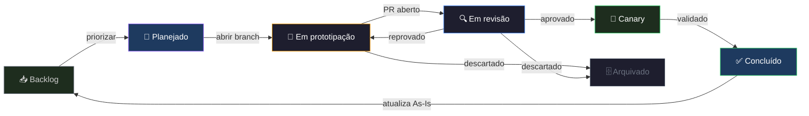

# Kanban de Experimentos

**Rota:** `/kanban`
**Status:** ⬜ Em desenvolvimento — ver [PROTO-006](../stories/PROTO-006)

O módulo Kanban é o **centro de comando dos protótipos e experimentos de produto** do Adsmagic Workspace. Inspirado no Linear, ele une gerenciamento de specs, ciclo de vida de experimentos e roadmap de priorização em uma única interface.

> Não é um kanban de vendas. É onde hipóteses nascem, são documentadas, validadas e despromovidas ou promovidas para produção.

---

## Dois espaços em um

### 1. Board de experimentos (kanban)

Representa o **ciclo de vida de cada experimento**, com colunas inspiradas no fluxo do Linear:

| Coluna | Significado |
|--------|-------------|
| **📥 Backlog** | Hipóteses identificadas, ainda não priorizadas |
| **🎯 Planejado** | Priorizado para execução — spec em andamento |
| **🔬 Em prototipação** | Branch ativa em `prototypes/feature/<nome>` ou `growth/<nome>` |
| **🔍 Em revisão** | PR aberto, aguardando validação do time |
| **🚀 Canary** | Entrou no pipeline de canary (repo de produção) |
| **✅ Concluído** | Validado com dados reais ou descartado com aprendizado registrado |
| **🗄️ Arquivado** | Hipótese descartada — aprendizado preservado no card |

### 2. Roadmap de experimentos

Vista em timeline que responde a: *"em que ordem vamos validar nossas hipóteses?"*

- Agrupa experimentos por trimestre ou horizonte (Now / Next / Later)
- Conectado ao board — mover para "Planejado" no board atualiza posição no roadmap
- Não é um roadmap de produto completo — é focado em **qual experimento prototipar a seguir**

---

## Anatomia de um card de experimento

Cada card no board representa um protótipo/experimento e contém:

```
┌─────────────────────────────────────────────┐
│  🔬 [PROTO-006] Kanban de Experimentos       │
│  ──────────────────────────────────────────  │
│  Hipótese: "Um quadro linear de specs        │
│  aumenta a clareza sobre o que está          │
│  sendo prototipado e o que está parado"      │
│                                              │
│  Branch: prototypes/feature/kanban-specs     │
│  Responsável: @ux + @dev                     │
│  Prioridade: 🔴 Alta                          │
│                                              │
│  📎 Anexos  ·  💬 Issues  ·  📋 Spec          │
└─────────────────────────────────────────────┘
```

| Campo | Descrição |
|-------|-----------|
| **ID** | `PROTO-NNN` — sequencial por ordem de criação |
| **Hipótese** | Uma frase: o que estamos testando e por quê |
| **Branch** | `prototypes/feature/<nome>` ou `prototypes/growth/<nome>` |
| **Responsável** | Agente ou pessoa responsável |
| **Spec** | Link para o `story-*.md` ou documento inline |
| **Anexos** | Referências, prints, links externos, Figma |
| **Issues** | Blockers, dúvidas abertas, decisões pendentes |
| **Resultado** | Preenchido ao mover para Concluído — o que aprendemos |

---

## Ciclo de vida completo



---

## Uso com agentes

Se o Kanban for usado como origem de prompts, handoffs ou despacho de tarefas para agentes, o dev precisa ter feito o setup inicial da IDE antes.

Sem sync e validação do ambiente, os responsáveis do card continuam sendo apenas metadados e não uma ativação garantida de agentes.

Veja o guia: [Agentes na IDE](../workflow/agentes-na-ide)

---

## Referências

- Pipeline completo de canary: [Workflow de prototipação](../workflow/prototipacao)
- Tabela de protótipos com status atual: [Produto To-Be](../product/to-be)
- Story de implementação do módulo: [PROTO-006](../stories/PROTO-006)
