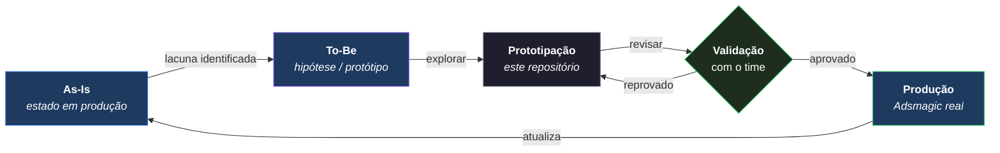

# Produto To-Be

Esta seção documenta como o Adsmagic deve ser — a visão de produto sendo explorada e validada por meio de protótipos neste repositório.

> O To-Be não descreve o que hoje está em produção. Para isso, veja [Produto As-Is](./as-is.md).

## Papel desta seção

O To-Be é o espaço de registro das decisões de evolução do Adsmagic. Aqui ficam:

- direções de produto ainda em exploração
- estruturas de experiência que diferem do estado atual
- módulos que ainda não existem mas estão sendo prototipados
- mudanças em fluxos existentes que afetarão a experiência real

## Ciclo de evolução

Cada protótipo neste repositório representa uma hipótese do To-Be. O ciclo é:

1. identificar lacuna ou oportunidade no As-Is
2. prototipar a solução neste repositório
3. validar com o time
4. **aprovado → vai para produção**
5. **As-Is é atualizado para refletir o novo estado de produção**
6. o item sai do To-Be ou é marcado como implementado

> **Regra:** o As-Is sempre espelha o que está em produção hoje. Quando algo do To-Be chega à produção, o As-Is muda. O To-Be nunca acumula o que já foi implementado.

## Áreas em evolução

As principais áreas atualmente sendo exploradas nos protótipos são:

### Dashboard

O estado atual (`dashboard-v2`) concentra métricas mas não oferece leitura operacional integrada. O To-Be explora um painel orientado a jornadas, com visão unificada de campanhas, contatos e performance.

### Campanhas

Hoje as campanhas Google Ads e Meta Ads são módulos independentes. O To-Be investiga uma visão unificada de gestão de campanhas multi-plataforma.

### Contatos e Vendas

O CRM atual (contatos + pipeline de vendas) está sendo repensado com foco em atribuição e conexão com as campanhas.

### Mensagens

A central de mensagens está sendo prototipar com uma abordagem mais integrada ao funil de conversão.

### Onboarding

O fluxo atual de criação de projeto está sendo simplificado para reduzir fricção na ativação.

## Como documentar aqui

Ao registrar uma decisão de To-Be, inclua:

- **Contexto**: qual parte do As-Is está sendo evoluída
- **Hipótese**: o que se está testando e por quê
- **Referência de protótipo**: qual tela ou fluxo no repositório representa isso
- **Status**: hipótese / validado / aprovado para implementação

## Critério editorial

Esta seção descreve intenção e direção, não compromisso de entrega. Tudo aqui pode mudar conforme os protótipos evoluem.