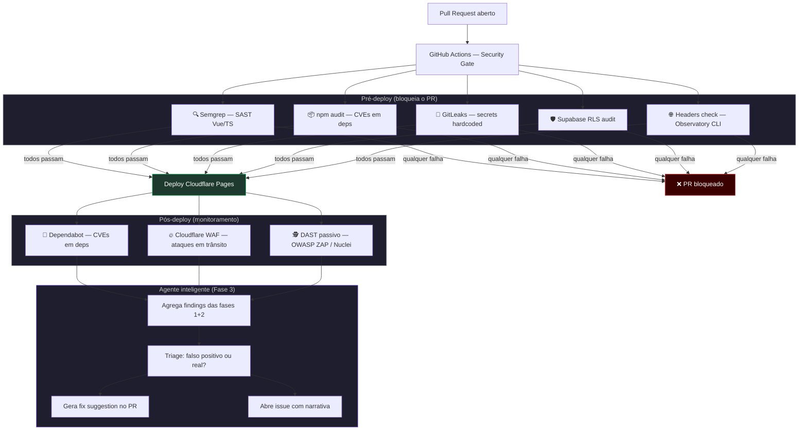

# PROTO-SEC-001 — Agente de Segurança no Pipeline

## Contexto

O pipeline atual (Cloudflare Pages + GitHub Actions) não possui nenhum gate de segurança automatizado. Antes de escalar para usuários reais com dados sensíveis (Meta Ads tokens, dados de agências), é necessário introduzir verificações de segurança que rodem **antes do deploy** (bloqueando o PR se necessário) e **após o deploy** (monitoramento contínuo).

Este é o plano em 3 fases. Esta story cobre a **Fase 1** — os gates básicos no GHA.

---

## Hipótese

> "Gates de segurança automatizados no CI/CD reduzem o risco de expor segredos, vulnerabilidades conhecidas e configurações inseguras antes que o código chegue a usuários reais — sem adicionar overhead manual ao time."

---

## Arquitetura proposta

---

## Fases

| Fase | Escopo | Status |
|------|--------|--------|
| **Fase 1** — Gates básicos (esta story) | SAST, npm audit, GitLeaks, headers no GHA | ⬜ Backlog |
| **Fase 2** — Monitoramento pós-deploy | Dependabot, WAF review, RLS audit nos migrations | ⬜ Backlog |
| **Fase 3** — Agente inteligente | Job GHA que agrega findings e chama Claude API para triage + fix | ⬜ Backlog |

---

## Critérios de Aceitação — Fase 1

### GitHub Actions — job `security-gate`

- [ ] Job roda em todo PR para `main` e `prototypes/growth/*`
- [ ] Job **bloqueia o merge** se qualquer gate falhar com severidade `high` ou `critical`

### Gate 1 — SAST (Semgrep)

- [ ] Semgrep configurado com rulesets `p/javascript`, `p/typescript`, `p/vue`
- [ ] Falhas de severidade `ERROR` bloqueiam o PR
- [ ] Resultado postado como comentário no PR com arquivo + linha + descrição

### Gate 2 — Dependency scan (npm audit)

- [ ] `npm audit --audit-level=high` roda na raiz e em `Plataforma/`
- [ ] CVEs de nível `high` ou `critical` bloqueiam o PR
- [ ] Relatório postado como comentário com pacote afetado e CVE ID

### Gate 3 — Secret scan (GitLeaks)

- [ ] GitLeaks varre o diff do PR (não o histórico completo)
- [ ] Qualquer finding bloqueia o PR imediatamente
- [ ] `.gitleaks.toml` com allowlist para falsos positivos conhecidos (ex: chaves de exemplo em docs)

### Gate 4 — Headers check

- [ ] Após deploy de preview no Cloudflare, job roda `observatory-cli` na URL de preview
- [ ] Alerta (não bloqueia) se score for abaixo de B
- [ ] Resultado postado como comentário no PR

### Gate 5 — Supabase RLS audit (script customizado)

- [ ] Script Python/Node varre arquivos de migration em `**/supabase/migrations/*.sql`
- [ ] Alerta se encontrar `CREATE TABLE` sem `ALTER TABLE ... ENABLE ROW LEVEL SECURITY`
- [ ] Bloqueia se tabela com padrão `*_tokens`, `*_credentials`, `*_secrets` não tiver RLS

---

## Fora de Escopo (fases 2 e 3)

- Configuração do Dependabot (Fase 2)
- Cloudflare WAF rules (Fase 2 — @devops)
- DAST com OWASP ZAP ou Nuclei (Fase 2)
- Integração com Claude API para triage (Fase 3)

---

## Arquivos a criar

| Ação | Arquivo |
|------|---------|
| CRIAR | `.github/workflows/security-gate.yml` |
| CRIAR | `.gitleaks.toml` |
| CRIAR | `scripts/rls-audit.js` — script de auditoria de migrations |
| CRIAR | `docs/docs/architecture/devsecops.md` — documentação da arquitetura de segurança |

---

## Referências

- [OWASP Top 10](https://owasp.org/www-project-top-ten/)
- [Semgrep rules para Vue](https://semgrep.dev/p/vue)
- [GitLeaks](https://github.com/gitleaks/gitleaks)
- [Mozilla Observatory](https://observatory.mozilla.org/)
- Discussão arquitetural: sessão de 31/03/2026

---

## Status

| Campo | Valor |
|-------|-------|
| Status | ⬜ Backlog |
| Prioridade | 🔴 Alta |
| Branch prevista | `prototypes/growth/devsecops-fase-1` |
| Responsável | @devops + @architect |
| Bloqueia | Deploy de produção com dados sensíveis de agências |
| Bloqueado por | Nenhum |
