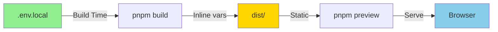

# 🔧 Guia de Troubleshooting - Variáveis de Ambiente Vite

**Problema:** `Error: Missing Supabase environment variables`  
**Contexto:** Vite + Vue 3 + TypeScript  
**Data:** 2025-12-09

---

## 🎯 Sintoma

Ao executar `pnpm preview` (ou acessar o build de produção), o navegador exibe:

```javascript
Uncaught Error: Missing Supabase environment variables
    at index-BCjZLDIK.js:7:5368
```

E no console da API:

```javascript
[API Response Error] {status: 401, message: Invalid JWT, url: /companies}
```

---

## 🔍 Diagnóstico

### Causa Raiz

O **Vite compila variáveis de ambiente no momento do build**, não em runtime. Se o arquivo `.env.local` não existia ou não foi carregado durante `pnpm build`, as variáveis `VITE_*` não foram injetadas no bundle final.

### Como o Vite Funciona



**Diferença entre `dev` e `preview`:**

| Comando | Quando lê `.env.local` | Pode alterar vars sem rebuild? |
|---------|------------------------|-------------------------------|
| `pnpm dev` | Runtime (sempre) | ✅ Sim (hot reload) |
| `pnpm build` + `pnpm preview` | Build-time (uma vez) | ❌ Não (precisa rebuild) |

### Por Que Acontece

1. **Build feito sem `.env.local`:**
   ```bash
   pnpm build  # ← .env.local não existia ainda
   # Vite compila com valores undefined
   ```

2. **`.env.local` criado depois:**
   ```bash
   cat > .env.local  # ← Criado APÓS build
   pnpm preview      # ← Serve bundle antigo (sem vars)
   ```

3. **Variáveis não prefixadas com `VITE_`:**
   ```bash
   # ❌ ERRADO - Vite ignora
   SUPABASE_URL=https://...
   
   # ✅ CORRETO - Vite injeta
   VITE_SUPABASE_URL=https://...
   ```

---

## ✅ Solução

### Passo 1: Verificar `.env.local`

```bash
cd front-end

# Verificar se existe
ls -la .env.local

# Ver conteúdo
cat .env.local
```

**Deve conter pelo menos:**

```bash
VITE_USE_SUPABASE=true
VITE_SUPABASE_URL=https://seu-projeto.supabase.co
VITE_SUPABASE_ANON_KEY=eyJhbGciOiJIUzI1NiIsInR5cCI6IkpXVCJ9...
```

### Passo 2: Rebuild

```bash
# Limpar build anterior
rm -rf dist/

# Build com variáveis corretas
pnpm build

# Verificar se injetou
grep -r "nitefyufrzytdtxhaocf" dist/
# ✅ Deve encontrar a URL do Supabase no bundle
```

### Passo 3: Preview

```bash
pnpm preview
```

**Ou alternativamente, use `dev` para teste rápido:**

```bash
pnpm dev  # ← Carrega .env.local em runtime (mais rápido)
```

---

## 🐛 Debugging Avançado

### 1. Verificar se Vite está carregando `.env.local`

**Adicionar log temporário em `vite.config.ts`:**

```typescript
import { defineConfig, loadEnv } from 'vite'

export default defineConfig(({ mode }) => {
  const env = loadEnv(mode, process.cwd(), '')
  
  // 🐛 DEBUG: Ver variáveis carregadas
  console.log('=== VITE ENV DEBUG ===')
  console.log('VITE_SUPABASE_URL:', env.VITE_SUPABASE_URL)
  console.log('VITE_USE_SUPABASE:', env.VITE_USE_SUPABASE)
  console.log('=====================')
  
  return {
    // ... resto da config
  }
})
```

**Executar:**
```bash
pnpm build
# Deve exibir os valores no console
```

### 2. Verificar se variáveis foram injetadas no bundle

```bash
# Procurar URL do Supabase no bundle
grep -r "nitefyufrzytdtxhaocf" dist/assets/

# Deve retornar algo como:
# dist/assets/index-BCjZLDIK.js: ...url:"https://nitefyufrzytdtxhaocf.supabase.co"...
```

Se **não encontrar**, significa que o build foi feito sem `.env.local`.

### 3. Testar em componente Vue

**Criar página de debug:**

```vue
<script setup lang="ts">
const envVars = {
  VITE_SUPABASE_URL: import.meta.env.VITE_SUPABASE_URL,
  VITE_SUPABASE_ANON_KEY: import.meta.env.VITE_SUPABASE_ANON_KEY?.substring(0, 20) + '...',
  VITE_USE_SUPABASE: import.meta.env.VITE_USE_SUPABASE,
  MODE: import.meta.env.MODE,
  DEV: import.meta.env.DEV,
  PROD: import.meta.env.PROD,
}
</script>

<template>
  <div>
    <h2>Environment Variables Debug</h2>
    <pre>{{ envVars }}</pre>
  </div>
</template>
```

**Acessar:**
```
http://localhost:5173/debug-env
```

Se `VITE_SUPABASE_URL` aparecer como `undefined`, o problema está confirmado.

---

## 🚨 Cenários Comuns

### Cenário 1: Build em CI/CD

**Problema:** GitHub Actions não tem acesso a `.env.local`

**Solução:** Usar **GitHub Secrets**

```yaml
# .github/workflows/deploy.yml
name: Deploy to Cloudflare

on:
  push:
    branches: [main]

jobs:
  deploy:
    runs-on: ubuntu-latest
    steps:
      - uses: actions/checkout@v3
      
      - name: Build
        env:
          VITE_SUPABASE_URL: ${{ secrets.VITE_SUPABASE_URL }}
          VITE_SUPABASE_ANON_KEY: ${{ secrets.VITE_SUPABASE_ANON_KEY }}
        run: |
          cd front-end
          pnpm install
          pnpm build
```

### Cenário 2: Deploy no Cloudflare Pages

**Problema:** Build no Cloudflare não lê `.env.local`

**Solução:** Configurar **Environment Variables** no dashboard

```bash
# Via CLI
wrangler pages secret put VITE_SUPABASE_URL --project-name=adsmagic-frontend
wrangler pages secret put VITE_SUPABASE_ANON_KEY --project-name=adsmagic-frontend

# Ou via Dashboard
# https://dash.cloudflare.com/ → Pages → Settings → Environment variables
```

### Cenário 3: Docker Build

**Problema:** Container não tem `.env.local`

**Solução:** Usar **build args**

```dockerfile
# Dockerfile
FROM node:18-alpine
WORKDIR /app

# Build args
ARG VITE_SUPABASE_URL
ARG VITE_SUPABASE_ANON_KEY

# Inject as ENV
ENV VITE_SUPABASE_URL=$VITE_SUPABASE_URL
ENV VITE_SUPABASE_ANON_KEY=$VITE_SUPABASE_ANON_KEY

COPY package*.json ./
RUN npm install

COPY . .
RUN npm run build
```

**Build:**
```bash
docker build \
  --build-arg VITE_SUPABASE_URL=https://... \
  --build-arg VITE_SUPABASE_ANON_KEY=eyJ... \
  -t adsmagic-frontend .
```

---

## 📋 Checklist de Verificação

Quando encontrar `Missing Supabase environment variables`:

- [ ] Arquivo `.env.local` existe?
- [ ] Variáveis prefixadas com `VITE_`?
- [ ] Build feito **depois** de criar `.env.local`?
- [ ] Preview usando build **atualizado**?
- [ ] Em CI/CD: Secrets configurados?
- [ ] Em Cloudflare: Env vars no dashboard?
- [ ] Em Docker: Build args passados?

---

## 🎓 Boas Práticas

### 1. Validar no `supabaseClient.ts`

```typescript
import { createClient } from '@supabase/supabase-js'

const supabaseUrl = import.meta.env.VITE_SUPABASE_URL
const supabaseKey = import.meta.env.VITE_SUPABASE_ANON_KEY

if (!supabaseUrl || !supabaseKey) {
  throw new Error(
    '❌ Missing Supabase environment variables!\n' +
    'Required: VITE_SUPABASE_URL, VITE_SUPABASE_ANON_KEY\n' +
    'Check your .env.local file'
  )
}

export const supabase = createClient(supabaseUrl, supabaseKey)
```

### 2. Criar `.env.example`

```bash
# .env.example (commitar no Git)
VITE_SUPABASE_URL=https://seu-projeto.supabase.co
VITE_SUPABASE_ANON_KEY=sua_chave_aqui
VITE_USE_SUPABASE=true
```

**No README:**
```bash
# Setup
cp .env.example .env.local
# Editar .env.local com valores reais
```

### 3. Usar TypeScript para validação

```typescript
// src/config/env.ts
interface EnvVars {
  VITE_SUPABASE_URL: string
  VITE_SUPABASE_ANON_KEY: string
  VITE_USE_SUPABASE: string
}

function validateEnv(): EnvVars {
  const required = [
    'VITE_SUPABASE_URL',
    'VITE_SUPABASE_ANON_KEY',
  ] as const
  
  const missing = required.filter(key => !import.meta.env[key])
  
  if (missing.length > 0) {
    throw new Error(
      `Missing environment variables: ${missing.join(', ')}\n` +
      'Please check your .env.local file'
    )
  }
  
  return import.meta.env as unknown as EnvVars
}

export const env = validateEnv()
```

### 4. Separar por ambiente

```bash
# .env.local (development)
VITE_SUPABASE_URL=https://dev.supabase.co

# .env.production.local (production)
VITE_SUPABASE_URL=https://prod.supabase.co
```

**Build para prod:**
```bash
pnpm build --mode production
```

---

## 🔗 Referências

- [Vite Env Variables](https://vitejs.dev/guide/env-and-mode.html)
- [Supabase Environment Variables](https://supabase.com/docs/guides/getting-started/quickstarts/vue)
- [Cloudflare Pages Build Configuration](https://developers.cloudflare.com/pages/platform/build-configuration/)

---

**Atualizado:** 2025-12-09  
**Autor:** DevOps Agent  
**Projeto:** AdsMagic First AI
