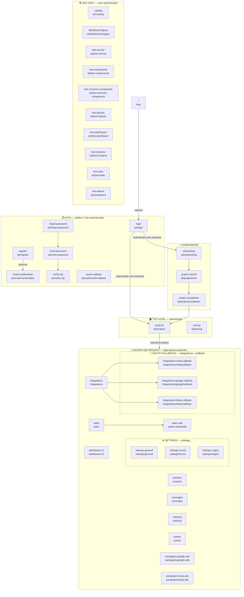

# AdsMagic — Mapa de Rotas

> Base URL (dev): `http://localhost:5200`  
> Locale padrão: `pt` | Suportados: `pt`, `en`, `es`  
> Rotas com `:projectId` exigem um UUID de projeto real na URL.

---

## Diagrama Mermaid

---

## Tabela Completa de Rotas

### 🔓 Auth — Público

| Nome | Path | Link (dev) | View |
|------|------|-----------|------|
| `login` | `/pt/login` | [Abrir](http://localhost:5200/pt/login) | `views/auth/LoginView.vue` |
| `register` | `/pt/register` | [Abrir](http://localhost:5200/pt/register) | `views/auth/RegisterView.vue` |
| `email-confirmation` | `/pt/email-confirmation` | [Abrir](http://localhost:5200/pt/email-confirmation) | `views/auth/EmailConfirmationView.vue` |
| `forgot-password` | `/pt/forgot-password` | [Abrir](http://localhost:5200/pt/forgot-password) | `views/auth/ForgotPasswordView.vue` |
| `reset-password` | `/pt/reset-password` | [Abrir](http://localhost:5200/pt/reset-password) | `views/auth/ResetPasswordView.vue` |
| `verify-otp` | `/pt/verify-otp` | [Abrir](http://localhost:5200/pt/verify-otp) | `views/auth/VerifyOtpView.vue` |
| `oauth-callback` | `/pt/auth/oauth/callback` | [Abrir](http://localhost:5200/pt/auth/oauth/callback) | `views/auth/OAuthCallback.vue` |

---

### 🚀 Onboarding & Project Wizard — Autenticado

| Nome | Path | Link (dev) | View |
|------|------|-----------|------|
| `onboarding` | `/pt/onboarding` | [Abrir](http://localhost:5200/pt/onboarding) | `views/onboarding/OnboardingView.vue` |
| `project-wizard` | `/pt/project/new` | [Abrir](http://localhost:5200/pt/project/new) | `views/project-wizard/ProjectWizardView.vue` |
| `project-completion` | `/pt/project/completion` | [Abrir](http://localhost:5200/pt/project/completion) | `views/project-wizard/CompletionView.vue` |

---

### 🏠 Top Level — Autenticado

| Nome | Path | Link (dev) | View |
|------|------|-----------|------|
| `projects` | `/pt/projects` | [Abrir](http://localhost:5200/pt/projects) | `views/projects/ProjectsView.vue` |
| `pricing` | `/pt/pricing` | [Abrir](http://localhost:5200/pt/pricing) | `views/pricing/PricingView.vue` |

---

### 📁 Escopo de Projeto — Autenticado + `:projectId`

> Substitua `:projectId` pelo UUID do projeto. Ex.: `/pt/projects/abc-123/dashboard-v2`

| Nome | Path (relativo ao projeto) | View |
|------|---------------------------|------|
| `dashboard-v2` | `dashboard-v2` | `views/dashboard/DashboardV2ViewNew.vue` |
| `contacts` | `contacts` | `views/contacts/ContactsView.vue` |
| `sales` | `sales` | `views/sales/SalesView.vue` |
| `sales-edit` | `sales/:saleId/edit` | `views/sales/SalesView.vue` |
| `messages` | `messages` | `views/messages/IndexView.vue` |
| `tracking` | `tracking` | `views/tracking/TrackingView.vue` |
| `events` | `events` | `views/events/EventsView.vue` |
| `integrations` | `integrations` | `views/integrations/IntegrationsView.vue` |
| `campaigns-google-ads` | `campaigns/google-ads` | `views/campaigns/GoogleAdsView.vue` |
| `campaigns-meta-ads` | `campaigns/meta-ads` | `views/campaigns/MetaAdsView.vue` |

---

### ⚙️ Settings — Autenticado + `:projectId`

| Nome | Path (relativo ao projeto) | View |
|------|---------------------------|------|
| `settings` | `settings` → redirect para `settings/general` | `views/settings/SettingsLayout.vue` |
| `settings-general` | `settings/general` | `views/settings/SettingsView.vue` |
| `settings-funnel` | `settings/funnel` | `views/settings/FunnelView.vue` |
| `settings-origins` | `settings/origins` | `views/settings/OriginsView.vue` |

---

### 🔑 OAuth Callbacks — Autenticado + `:projectId`

| Nome | Path (relativo ao projeto) | View |
|------|---------------------------|------|
| `integrations-meta-callback` | `integrations/meta/callback` | `views/integrations/callbacks/MetaCallbackView.vue` |
| `integrations-google-callback` | `integrations/google/callback` | `views/integrations/callbacks/GoogleCallbackView.vue` |
| `integrations-tiktok-callback` | `integrations/tiktok/callback` | `views/integrations/callbacks/TikTokCallbackView.vue` |

---

### 🔀 Redirects

| De | Para |
|----|------|
| `/` | `/{locale}/login` |
| `/pt/projects/:projectId/dashboard` | `/pt/projects/:projectId/dashboard-v2` |
| `/pt/projects/:projectId/settings` | `/pt/projects/:projectId/settings/general` |

---

### 🛠️ Dev Only — Sem Autenticação

| Nome | Path | Link (dev) | View |
|------|------|-----------|------|
| `catalog` | `/pt/catalog` | [Abrir](http://localhost:5200/pt/catalog) | `views/catalog/ComponentsCatalog.vue` |
| `dashboard-legacy` | `/pt/dashboard-legacy` | [Abrir](http://localhost:5200/pt/dashboard-legacy) | `components/features/DashboardLegacy.vue` |
| `test-service` | `/pt/test-service` | [Abrir](http://localhost:5200/pt/test-service) | `views/TestServiceView.vue` |
| `test-components` | `/pt/test-components` | [Abrir](http://localhost:5200/pt/test-components) | `views/TestComponentsView.vue` |
| `test-common-components` | `/pt/test-common-components` | [Abrir](http://localhost:5200/pt/test-common-components) | `views/TestCommonComponentsView.vue` |
| `test-layouts` | `/pt/test-layouts` | [Abrir](http://localhost:5200/pt/test-layouts) | `views/TestLayoutsView.vue` |
| `test-dashboard` | `/pt/test-dashboard` | [Abrir](http://localhost:5200/pt/test-dashboard) | `views/TestDashboardView.vue` |
| `test-contacts` | `/pt/test-contacts` | [Abrir](http://localhost:5200/pt/test-contacts) | `views/TestContactsView.vue` |
| `test-radix` | `/pt/test/radix` | [Abrir](http://localhost:5200/pt/test/radix) | `views/test/TestRadixComponents.vue` |
| `test-tokens` | `/pt/test/tokens` | [Abrir](http://localhost:5200/pt/test/tokens) | `views/test/TestRadixComponents.vue` |

---

## Resumo de Contagem

| Grupo | Qtd |
|-------|-----|
| Auth (público) | 7 |
| Onboarding / Wizard | 3 |
| Top Level (auth) | 2 |
| Escopo de Projeto | 10 |
| Settings | 4 |
| OAuth Callbacks | 3 |
| Dev Only | 10 |
| **Total** | **39** |
